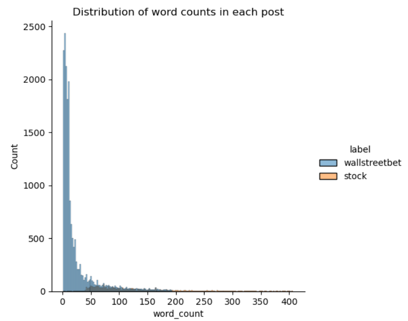
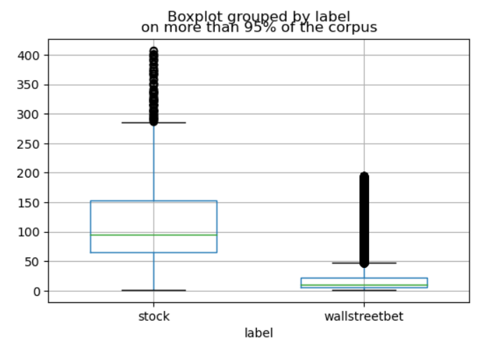
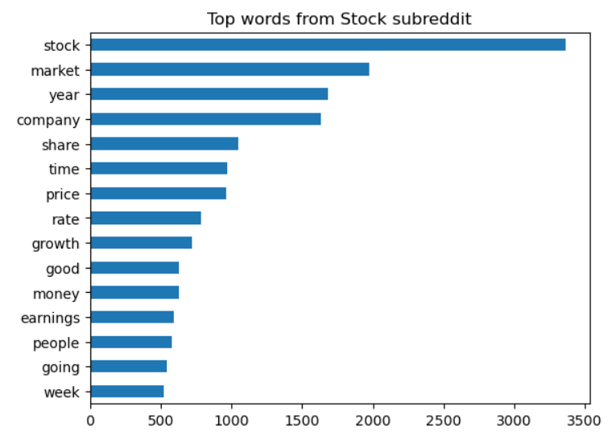
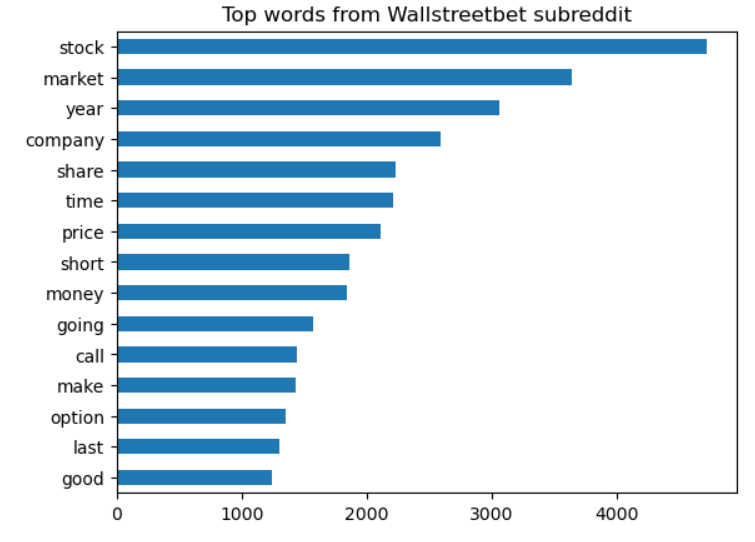
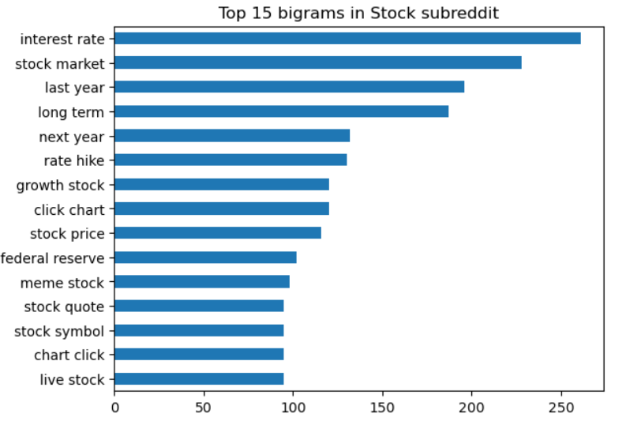
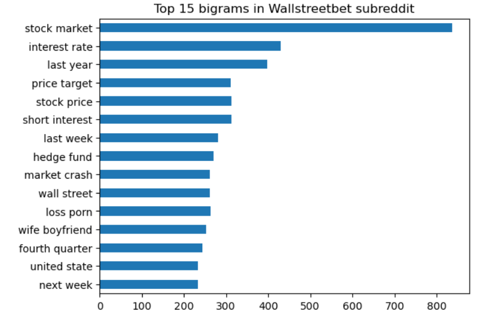
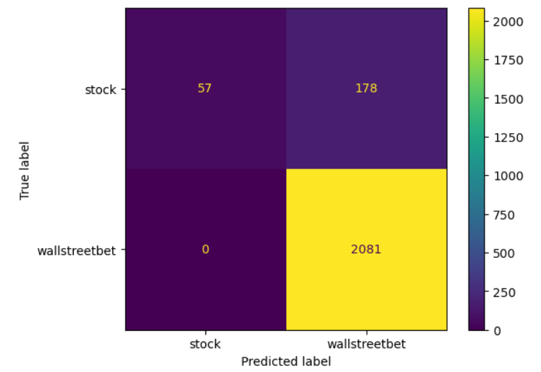
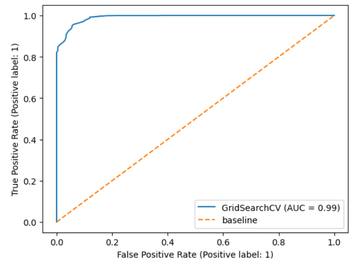
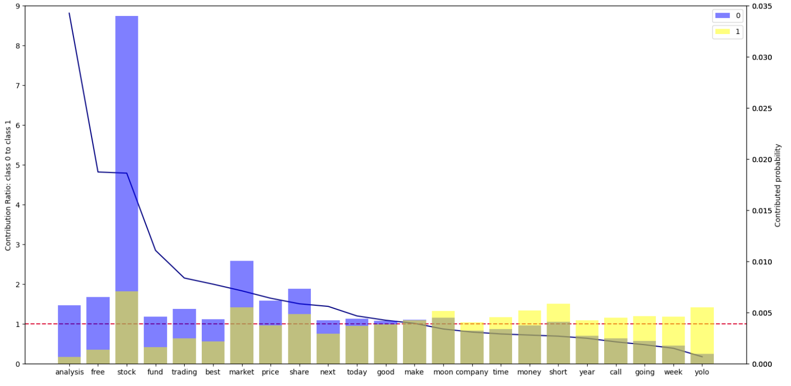

#  Project 3: Web APIs & NLP

## 01 Problem Statement

We are hired by Robinhood Markets Inc. as the Business Consultant. Robinhood is a Fintech Startup that operates an online trading platform for stocks, ETFs, options and crypto investment. It has a minimum bar for investors such as zero-commission fee, no account minimums, no maintentance fees and provides the users with gamified trading experience. As a result the initial user base are mostly inexperienced new investors who trade frequently. The company faces the problem of being accused of encouraing active trading behavior and was fined by the financial regulatory institute for having not equipped its customer with sufficient investmment knowledge. The senior management of Robinhood have responded with two major actions regarding this, one is to provide more educational resources, and second is to work on the user base by attracting more experienced investors that are more inclined to passive trading.

Our team is designated to work on the second strategy on the user base. We decided to approach the problem with targeted web advertisement to more experienced investors who favors long-term investment. One of our intended contextual data sources is the social news media reddit and we will use NLP to identify posts from two investment-related subreddit groups: r/WallstreetBets and r/Stocks. As r/Wallstreetbets posts are filled with ideas for extremely risky stock and options plays, it is supposed not the community for our target adversing audience. In r/Stocks are generally more serious discussions with ananlysis, and the more stringent content policy over certain topics such as 'Penny Stocks' (stock with low market capitalization and volume) has ensured the discussions are more inclined to long-term investment. For such reasons we decided that r/Stocks is a community of our target advertisement audience. 

We will use NLP to learn the contextual data from both r/Wallstreebets and r/Stocks and come up with a classficiation model to identify which of the two groups an unseen posts is from. IF-IDF vectorizer will be used to transform the textual data into numerical representation. Different classificatino models will be tested out, metrics that represented model's ability to identify the target r/stocks post group will be particularly emphasized as the the indicator of the model performance. We aim at a production model that have a F1_score higher than 0.95. When evaluating the models, Specificity will be emphasized as we are going to assign 0 to the target r/stocks class, and hence Specificity represents the rate of accurate predictions among all 0 predications. 

The model we developed will be the basis for further actions in targeted advertisement. 

## 02 Data Collection

PushshiftAPI() was used to scrap the posts from the two subreddit groups. PMAW is a wrapper for the Pushshift API which uses multithreading to retrieve Reddit comments and submissions. In particular, the 'search_submissions' method has been used for scraping the posts, as it does not give disruption after certain number of requests. The documentation for search_submissions in PMAW library is at https://github.com/mattpodolak/pmaw/blob/master/README.md#pushshiftapi. 

Initial tests suggests that the two groups differ in the number of posts quite a lot, hence the traffic of the group with less posts (r/stocks) is considered when choosing the timeframe of the scraping process. As there are on average 4000 posts in r/Wallstreetbets and 1000 posts in r/Stocks every week, a one-month timeframme is taken to gurantee enough posts from r/stocks. The timeframe was choosen to be 2022 Jan 1st to 2022 Feb 1st. The wall time for scapping of 30-day data is below 2 min, which is acceptable. The raw data are saved in 'raw_data.csv'.

The data were stored in a dataframe, and upon inspection there are 82 columns, and the information useful to our case are: 1). the titles of the posts stored in the 'title' column, and 2). the comments stored in 'selftext' column.  Some initial data cleaning was carried out like checking that all 'title' values are non empty. The  textual data from the title and selftext are combined and stored in one 'text' column. Labeling with the subreddit group each post is from was stored in the 'label' column and the dataframe is stored as 'textual_data_with_labels.csv'.

## 03 Data Cleaning & EDA

The followsing steps are taken for the data cleaning and EDA part: 

* Ensure there is no empty value in the textual content column 
* Remove special characters and replace newlines with space using Regex
* Remove the posts that have been removed (considered low Karma by the subreddit group)
* Add word count for each post
* Remove url links while keeping the textual content for posts with urls
* Summary statistics 
* EDA on post lengths and remove outliers that are duplicate posts
* EDA on top occurance words (unigrams and bigrams)

#### Statistical summary 
After cleaning, data from r/wallstreetbets takes the ratio of 0.898, while data from r/stocks only account for 0.102, this gives the baseline accuracy score for the classfication problem - an accuracy of 90% if we predict everything to belong to the majority class r/wallstreetbets. 

#### EDA on post lengths (word count) 

| Words in a post   | Stocks  | WallStreetBets  |
| ----------------- |:-------:|-----------------|
| Max               |    5756 |            3362 |
| Mean              |     178 |              45 |
| Median            |     101 |              10 |
| Variance          |   94050 |           22285 |

#### Distribution of post lengths (for above 95% of data)
Distributions of words counts in both subreddit groups have a long tail on the high end. Inspection on the outliers on the far high ends shows that they are actually all legitimate posts, so we will keep them in the data. But for better visualization purpose, we will only include data within 1 standard deviations from the mean (which will have covered above 95% of the data). 

#### Boxplot: post lengths of over 95% of the data

#### EDA on top occurance words  

#### Top 15 unigrams

#### Top 15 bigrams 

From the top occurance words, the collection of top occuring words in unigrams for each group overlap quite a lot, there are two major difference observable at this stage:

* The ranking of each specific word differs in unigrams;
* The bigrams show quite different combinations of words picked up by the countvectorizer.
* There are more technical terms coming up in r/Stocks, such as 'rate hike', 'chart' that suggest there are more technical analysis in the r/stocks.

These differences suggest there is enough difference between the two groups to be learnt by the classification model in later steps, and the problem is decipherable through NLP.

## 04 Preprocessing & Modeling

#### Mapping and key metrics of models 
We have mapped 'stock' to class 0 and 'wallstreetbet' to class 1. Base on this mapping, as our project objective is to target r/stocks posts (class 0), the most important metric are Specificity and Negative Predictive Value.

Here specificity represents the model's True Negative Rate (rate of correctly predicted r/stocks posts among all real r/stocks posts); and Negative Predictive Value (NPV) represents the model's rate of real r/stocks posts among all the predicted r/stocks posts. Though both Specificity and NPV are important, the NPV is prioritized over Specificity in our casestudy because we want to minimize false negatives as we really don't want to falsely target a r/wsb posts for advertisement and ended up channeling more wsb users to our client's app to worsen the current situation (as a trade-off we can afford to miss out some r/stocks posts, hence we can accept a Specificity that is not very high). 

Hence the objective here is to train a model that have the highest NPV score and an reasonably high Specificity score, as well as an reasonably high F1 score.

#### Key steps in this part: 
* Vectorize the text using TF-IDF
* Define the baseline model: the baseline null model (predicting all results as the majority class) will give a 89.8% accuracy. But its specificity metric is 0. 
* Set up pipelines for gridsearch for combinations of TF-IDF vectorizer with different classification models inlcuing Multinomial NB, Random Forest, LinearSVR. Boosting method VotingClassifier has also been tried out. It is worth noting that the 'class_weight' parameter has all been set to 'balanced' for these models except in Multinomial NB which does have this in configuration. Lemmatization and customized stop_word list have been included in the gridsearch process for all models.
* Treat the imbalanced dataset using oversampling method, and rerun the Multinomical NB and Random Forest models. 

#### Model selection: 
* Among models on the original imbalanced dataset, the LinearSVR model outperforms Multinomial NB, Random Forest and VotingClassifier in having the highest Specificity and NPV scores. 
* Once the training dataset has been treated using oversampling method (through resampling on the training dataset with replacement without modifying the testing dataset to prevent data leakage), the performance of the Multinomial NB and Random Forest have greatly improved, especially for their NPV scores. 

* As we have decided NPV is prioritized over Specificity in our casestudy because we want to minimize false negatives as we really don't want to falsely target a r/wsb posts for advertisement and ended up channeling more wsb users to our client's app, Hence we will choose the model with a highest NPV score and a relatively high Specificity score (we can afford to miss out some r/stocks posts as a trade-off). 

* Among such models with a highest NPV and an acceptable Specificity score, the Random Forest model is sightly outperformed by the Multinomical NB model by a slight amount in the Specificity score; yet for the benefit of interpretability, we will choose the Multinomial NB with oversampling treatment) as the production model. The interpretation of the model output will be presented in Part 5. 

#### Confusion matrix of the production model 

#### AUC curve of the production model 

## 05 Evaluation and Conceptual Understanding
 
|   |               Model                    | Training F1 | Testing F1 | Training Accuracy | Testing Accuracy |   Specificity|  NPV    |  AUC  |
|:-:|:--------------------------------------:|:-----------:|:----------:|:-----------------:|:----------------:|:------------:|:-------:|:-----:|
| 0 | Baseline (null model)                  |     0.947   |    0.947   |       0.899       |      0.899       |      0       |   -     | 0.50  |
| 1 | TF-IDF + Multinomial NB                |     0.952   |    0.950   |       0.910       |      0.905       |      0.089   | 0.809   | 0.85  |
| 2 | TF-IDF + Random Forest                 |     0.999   |    0.954   |       0.999       |      0.914       |      0.226   | 0.746   | 0.92  |
| 3 | TF-IDF + LinearSVC                     |     0.998   |    0.928   |       0.999       |      0.961       |      0.485   | 0.713   | 0.93  |
| 4 | TF-IDF + VotingClassifier              |     0.983   |    0.953   |       0.970       |      0.915       |      0.400   | 0.627   |  -    |
| 5 | TF-IDF + Multinomial NB (oversampling) |     1.000   |    0.958   |       1.000       |      0.921       |      0.217   | 1.000   | 0.99  |
| 6 | TF-IDF + Random Forest (oversampling)  |     1.000   |    0.959   |       1.000       |      0.921       |      0.243   | 1.000   | 0.99  |

Evaluation of the model performance: 

* Baseline model (predicting all results as the majority class) will give a 89.8% accuracy, but the specificity metric is 0 as the model does not correctly predict any data as the r/stocks class. 

* Based on the F1 scores, all models are overfit for up to 4-7%. 

* As we have explained in Part 04, the most two important metrics are Negative Predictive Value (NPV) and Specificity. These two collectively represent the model's ability of correctly identifying class r/stocks posts. And NPV is prioritized if we need to trade off between the two. F1 score on the testing dataset is also a metric we looked at. 

* As shown in the table above, performance of model 0-4 are characteristic of an imbalanced dataset. Due to the high imbalance (0.9/0.1 ratio), even the null baseline model of predicting everything as the majority class has high F1 score and accuracy as the majority class correct predition rate has overwhelmed the false prediction rates on the minority class. This effect has dominated the metrics of accuracy and F1 score, hence for accuracy and F1 score, Model 1-4 do not give much room of improvement from the baseline score. However, the metric Specificity and NPV have increased substantially. 

* Model 2-4 have all incorpurated class_weight='balanced' in their argument inputs to give more penalty to the false preditions on the minority class. Among Model 1-4 on the original imbalanced dataset, Model 3 LinearSVR model outperforms the other three in having the highest Specificity and NPV scores. In Model 5-6, once the training dataset has been treated using oversampling method to achieve a balanced input, the performance of the Multinomial NB and Random Forest have greatly improved, especially for their NPV scores.

* As NPV is prioritized over Specificity in our casestudy, the Specificity and NPV scores of Model 5 and 6 are preferable than Model 3. For the benefit of interpretability, we will choose the Model 5 (multinomial NB with oversampling treatment) as the production model. 

### Interpretation of results (TF-IDF+Multinomial with oversampling treatment)
We have extracted the features with the highest probability of occurance for both classes:
r/Stock top words: ['stock' 'market' 'share' 'free' 'price' 'analysis' 'trading' 'fund'
 'moon' 'today' 'best' 'make' 'next' 'good' 'short']
r/Wallstreetbet top words: ['stock' 'short' 'yolo' 'market' 'money' 'moon' 'share' 'going' 'week'
 'time' 'call' 'year' 'make' 'company' 'good']

It can be seen that quite a few of the top occurance words are shared by both groups, like 'stock', 'market' and so on. But there do exist words that occurs highest only in one particular class, for example, 'trading', 'fund', 'analysis' only top in the stock class, while 'yolo' only top in wallstreetbet class.

We have converted the logrithmic probabilities in the output to true scale. To gain an idea of how the likelihood of occurance compares between the two classes for each word, we will also plot the ratio between the probability of occurance for between the two classes. Those words with ratio value higher than 1 have a higher probability of occurance in class 0 (stocks) relative to that of class 1 (wallstreetbets), and existence of such words in a document will contribute to its being predicted stock posts. 

#### Plot of probabilistic contribution of top features

1. On the X-axis are the top 15 features from both r/stocks and r/wallstreetbets. As there are 7 overlaping features, in total there are 23 features in the plot.

2. The blue bars represents each word's probability of occurance in a Class 0 (r/stocks) post; whereas the yellow bars represents each word's probability of occurance in a Class 1 (r/wallstreetbet) post. The y values of the bar plots are on the right side. Based on the Naive Bayes assumption, we can effectively interprete the blue bars as the probabilitistic contribution of the presence of a particular word in a text document to the probabilitity of that document belonging to Class 0 (stock); and likewise, the yellow bars represent the probabilitstic contribution of the presence of a particular word in a text document to the probability of that document belonging to Class 1 (wallstreetbet).

3. The blue line represents the ratio between the two probabilities of occurance in Class 0 (r/stock) post versus in Class 1 (r/wallstreetbets) post for a particular word. The y values of the line plot is on the left side. The blue line gives a good indication of a word's relative contribution to classifying documents with the word to r/stocks versus to r/wallstreetbets.

4. The words on the X-axis are sorted in decending order in the ratio of the two probabilities as defined in (3). Hence the more towards the left, presence of the words are more biased to contributing to classifying documents with them as r/stocks, whereas the more towards the right, presence of these words are more biased to contributing to classifying documents with them as r/wallstreetbet.

5. The dashed horizontal red line denotes y=1, and its intersection with the blue line defined in (3) have seperated the words on the X-axis to two groups: presence of those of the left side have a higher contribution to classifying to r/stocks rather than r/wallstreetbets subreddit; presence of those words to the right hand side have a higher contribution classifying into r/wallstreetbet.

6. If we want to identify the top words that distinguish a document as a 'r/stocks' post, then we should take from the left hand side, the most prominent five being 'analysis', 'free', 'stock', 'fund' and 'trading'.

7. Likewise, if we want to identify the top words that distinguish a document as a 'r/wallstreetbet' post, we should take from the right hand side, the most prominent five being 'yolo', 'week', 'going', 'call' and 'year'.

8. It can be seen from the bar charts that there are some common top occurance words that have similar probablistic contribution to both classes, such as 'good', 'make' and 'moon'. If there is future analysis on top of this work, these words can be added to the stop_word list, as they do not help much to distinguish between the two classes.

## 06 Conclusion and Recommendations

In conclusion, in this project we have used NLP to learn from the textual data scrapped from r/stocks and r/wallstreetbets, explored the top occuring words, and trained a series of pipelines with TF-IDF vectorizer and different classification models with boosting methods, to conclude on the final production model as TF-IDF+Multinomial NB (with oversampling treatment). The model can successfully classify a post from r/Stocks (at a NPV score 1.0 and a Specificity at 0.217). We have successufully minimized false negatives to 0 and have avoided mis-targeting any r/wsb posts for ads and channeling more wsb members to the client's app, and as a trade-off the specificity is not very high, it is acceptable as we can afford to miss out some r/stocks posts in the targeting ads context. The other metrics suggest that the production model performs well (testing F1_score 0.958 albeit slightly overfit). We have also interpreted the output from the production model and ranked the key words that will contribute the most to classify a document with their presence to each class. 

The production model will be the basis for targeting the right audience of advertisement for our client (by pushing ads to the r/stocks posts only). 

Future research can build on the set of keywords we have identified that contribute the most to differentiating the classes, and extrapolate on other textual data on other social news platforms. Another possibility for future work is using pre-trained models that take into account the contextual meaning of words (e.g. Hugging face) instead of simplying using frequency of word occurance, which may reveal new insights on the set of keywords/phrases that identifies each class. 

