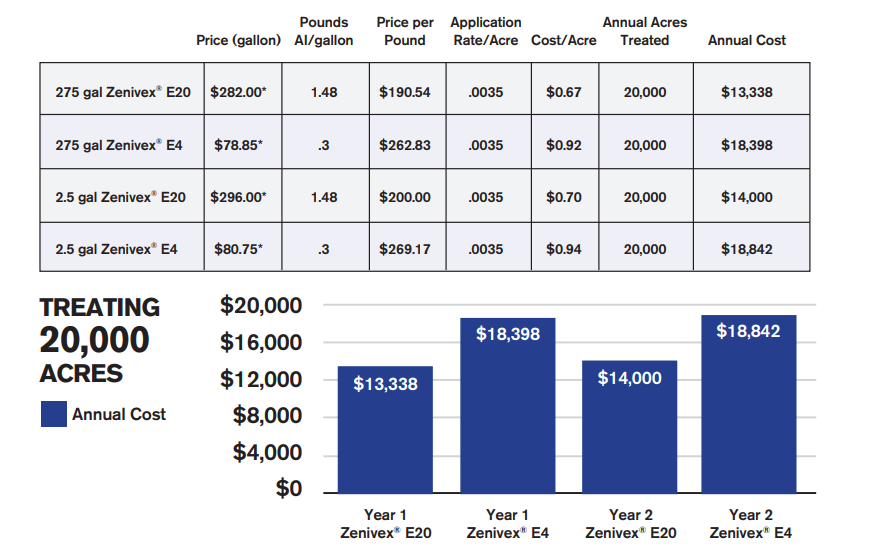

#  West Nile Virus Prediction

## Background

The West Nile Virus (WNV) has been a worrying disease for the United States since 1999. West Nile virus is most commonly spread to humans through infected mosquitos.The [CDC](https://www.cdc.gov/westnile/index.html) has acknowledged it as the leading cause of mosquito-borne disease feeding on infected birds [(*source*)](https://parasitesandvectors.biomedcentral.com/articles/10.1186/1756-3305-3-19#citeas) in the continental United States. Now, there are still no vaccines to prevent or medications to cure WNV patients -- statistics data from the CDC, West Nile fever (WNF) is a potentially serious illness for humans and approximately 1 in 150 infected people develop a serious illness with symptoms that might last for several weeks. Around 20% of people who become infected with the virus develop symptoms ranging from a persistent fever, to serious neurological illnesses that can result in death. Approximately 4/5 show no symptoms at all [(*source*)](http://www.cdc.gov/westnile/faq/genQuestions.html).

In Illinois, [West Nile virus was first identified in September 2001](https://www.dph.illinois.gov/topics-services/diseases-and-conditions/west-nile-virus) when laboratory tests confirmed its presence in two dead crows found in the Chicago area. In 2002, the first human cases of West Nile virus were reported in Chicago and death from West Nile disease were recorded and all but two of the state's 102 counties eventually reported a positive human, bird, mosquito or horse. By the end of 2002, Illinois had counted more human cases (884) and deaths (64) than any other state in the United States. By 2004 the City of Chicago and the Chicago Department of Public Health (CDPH) had established a comprehensive surveillance and control program that is still in effect today. Every week from late spring through the fall, mosquitos in traps across the city are tested for the virus.

Since then, Illinois and more specifically Chicago, has continued to suffer from multiple outbreaks of the WNV. From 2005 to 2016, a total of 1,371 human WNV cases were [reported](https://journals.plos.org/plosone/article?id=10.1371/journal.pone.0227160) within Illinois. Out of these total reported cases, 906 cases (66%) were from the Chicago region (Cook and DuPage Counties).  

Dataset used in thie project is included as `train.csv, test.csv, spray.cvs` and `weather.csv`. Datasets were provided by Kaggle.

## Problem Statement

As data scientists in the Division of Societal Cures in Epidemiology & New Creative Engineering (DATA-SCEINCE), we want to **understand the factors driving the spread of Wnv** by leveraging on data collected by Chicago's weather stations and the surveillance system set up by the Chicago Department of Public Health (CDPH) . We also want to **develop a classfication model that could predict the outbreaks of Wnv** within the area of Windy City. Through these studies, we hope to help the City of Chicago and the Chicago Department of Public Health more efficiently and effectively allocate resources toward preventing the transmission of this potentially deadly virus. Our aim is to determine the best strategy for controlling the spread of the WNV

## Datasets

- `train.csv` : the training set consists of data from 2007, 2009, 2011, and 2013.
- `test.csv`  : the test set is used to predict the test results for 2008, 2010, 2012, and 2014.
- `weather.csv`: weather data from 2007 to 2014.
- `spray.csv` : GIS data of spraying efforts in 2011 and 2013

Every year from late-May to early-October, public health workers in Chicago setup mosquito traps scattered across the city. Every week from Monday through Wednesday, these traps collect mosquitos, and the mosquitos are tested for the presence of West Nile virus before the end of the week. The test results include the number of mosquitos, the mosquitos species, and whether or not West Nile virus is present in the cohort.

<u>`train` & `test` dataset </u>

These test results are organized in such a way that when the number of mosquitos exceed 50, they are split into another record (another row in the dataset), such that the number of mosquitos are capped at 50. The location of the traps are described by the block number and street name. These attributes have been mapped into Longitude and Latitude in the dataset and are derived locations. For example, Block=79, and Street= "W FOSTER AVE" gives us an approximate address of "7900 W FOSTER AVE, Chicago, IL", which translates to (41.974089,-87.824812) on the map.

Some traps are "satellite traps". These are traps that are set up near (usually within 6 blocks) an established trap to enhance surveillance efforts. Satellite traps are postfixed with letters. For example, T220A is a satellite trap to T220. Not all the locations are tested at all times. Also, records exist only when a particular species of mosquitos is found at a certain trap at a certain time.

<u>`spray` dataset</u>

The City of Chicago also does spraying to kill mosquitos. Spraying can reduce the number of mosquitos in the area, and therefore might eliminate the appearance of West Nile virus.

<u>`weather` dataset</u>

It is believed that hot and dry conditions after wetter condition are more favorable for West Nile virus than cold and wet. The dataset is from National Oceanic and Atmospheric Administration (NOAA) of the weather conditions of 2007 to 2014, during the months of the tests.

Station 1: CHICAGO O'HARE INTERNATIONAL AIRPORT Lat: 41.995 Lon: -87.933 Elev: 662 ft. above sea level

Station 2: CHICAGO MIDWAY INTL ARPT Lat: 41.786 Lon: -87.752 Elev: 612 ft. above sea level

## Data Dictionary

| **Columns** | **Type** | **Dataset** | **Description** |
|---|---|---|---|
| **Id** | *integer* | test | The id of the record |
| **Date** | *datetime* | train/ test | Date that the WNV test is performed (YYYY-MM-DD) |
| **Address** | *object* | train/ test | Approximate address of the location of trap. This is used to send to the GeoCoder. | 
| **Species** | *object* | train/ test | The species of mosquitos |
| **Block** | *integer* | train/ test | Block number of address | 
| **Street** | *object* | train/ test | Street name |
| **Trap** | *object* | train/ test | Id of the trap |
| **AddressNumberAndStreet** | *object* | train/ test | Approximate address returned from GeoCoder |
| **Latitude, Longitude** | *float* | train/ test | Latitude and Longitude returned from GeoCoder |
| **AddressAccuracy** | *integer* | train/ test | Accuracy returned from GeoCoder |
| **NumMosquitos** | *integer* | train/ test | Number of mosquitoes caught in this trap |
| **WnvPresent** | *integer* | train/ test | Whether West Nile Virus was present in these mosquitos. (1 means WNV is present, while 0 means WNV is absent.) 
| **Date** | *datetime* | spray | The date of the spray (YYYY-MM-DD) |
| **Time** | *object* | spray | The time of the spray |
| **Latitude, Longitude** | *float* | spray | The Latitude and Longitude of the spray |
| **Station** | *integer* | weather | Weather station (1 or 2) |
| **Date** | *datetime* | weather | Date of measurement (YYYY-MM-DD)|
| **Tmax** | *integer* | weather | Maximum daily temperature (in Degrees Fahrenheit, F) |
| **Tmin** | *integer* | weather | Minimum daily temperature (in Degrees Fahrenheit, F) |
| **Tavg** | *object* | weather | Average daily temperature (in Degrees Fahrenheit, F) |
| **Depart** | *object* | weather | Departure from normal temperature (in Degrees Fahrenheit, F) |
| **DewPoint** | *integer* | weather | Average Dew Point temperature (in Degrees Fahrenheit, F) |
| **WetBulb** | *object* | weather | Average Wet Bulb temperature (in Degrees Fahrenheit, F) |
| **Heat** | *object* | weather | Heating Degree Days (season begins with July) |
| **Cool** | *object* | weather | Cooling Degree Days (season begins with January) |
| **Sunrise** | *object* | weather | Time of sunrise (calculated) |
| **Sunset** | *object* | weather | Time of sunset (calculated) |
| **CodeSum** | *object* | weather | Code of significant weather phenomena |
| **Depth** | *object* | weather | Snow/ice depth on the ground in inches, measured at 1200 UTC |
| **Water1** | *object* | weather | Water equivalent in inches, measured at 1800 UTC |
| **SnowFall** | *object* | weather | Total snowfall precipitation for the day (in inches and tenths) |
| **PrecipTotal** | *object* | weather | Total water equivalent precipitation for the day (in inches and tenths).  |
| **StnPressure** | *object* | weather | Average station pressure (in inches of hg) |
| **SeaLevel** | *object* | weather | Average sea level pressure (in inches of hg) |
| **ResultSpeed** | *float* | weather | Resultant wind speed (mph) |
| **ResultDir** | *integer* | weather | Resultant wind direction (degrees) |
| **AvgSpeed** | *object* | weather | Average wind speed (mph) |

# Objective
This is a supervised learning task, since the labels are provided (the expected output, i.e., binary representation of whether WNV was present within mosquito traps). 

We will be predicting two discrete class labels. More specifically, this is a binary classification problem with the ultimate goal -- to build a classifier to distinguish between just two classes, whether WNV was present in these mosquitos. 1 means WNV is present, and 0 means not present.

We will evaluate the performance of our model **using AUC (Area Under Curve) score as the North Star metric**. AUC score can be obtained by measuring the area under the receiver operating characteristic(ROC) curve. The ROC curve plots the true positive rate (TPR) against the false positive rate (FPR).  Our motivation is to increase the correct prediction (TP, TN) out of all the prediction, to detect correctly. The closer the AUC score to 1, the better the model is performing. 

# Data Cleaning
With the given 4 datasets, we have carried out initial analysis on each of them and produced the summary and list of cleaning works to be done.
These include 
- dropping duplicate rows, 
- imputing missing and zero values, 
- splitting strings and replace with correct format, 
- converting to right data types,
- dropping columns with high missing values
- creating more interpretable features

# EDA Summary
- The WNV incidences were highest in August.
- Species that are tested positive for West Nile Virus:Restuans or Pipiens species.
- From map visualisation, the occurences of West Nile virus is more prevalent near bodies of water and O’Hare airport.
- There are 136 traps. T900 (at Ohare airport) is sampled the most.
-  From the scatter plot, we can see that the occurences of West Nile Virus are more prevalent during days with hotter temperatures.
- From the scatter plot, we can see that the occurences of West Nile Virus are more prevalent during days with high humidity.
- Spraying is only effective in keeping the mosquito population under control on certain days.
- From map visualisation, We can see that spray area fails to fully overlap with the virus outbreak.
- Based on the heatmaps above, the existing features seem to have low correlation with the target. Therefore, we will have to perform feature engineering to extract more information from our data and improve the correlation scores.

# Feature Engineering
1. Weather -- Sunhour Feature
To capture the duration of the day, or number of hours when the Sun is out: 
SunHours = Sunset - Sunrise

2. Weather -- Codesum Feature
Replace all empty rows with '0' due to uneventful weather (quiet weather pattern)
Create dummy variables - Rain, Snow, Windy and Misty - as follows:
Rain = 1 if CodeSum contains ['TS', 'RA', 'DZ', 'SH'] else = 0
Snow = 1 if CodeSum contains ['SN', 'SG', 'GS', 'PL', 'IC', 'DR',’BC',’GR'] else = 0
Windy = 1 if CodeSum contains ['SQ', 'DS', 'SS', 'PO', 'BL'] else = 0
Misty = 1 if CodeSum contains ['BR', 'HZ', 'FG', 'FU'] else = 0

3. Weather -- Humidity Feature
High humidity conditions tend to favour mosquito activity
Create Humidity column using DewPoint and Tavg (Average temperature)
weather['Humidity'] = np.round(100-25/9*(weather['Tavg']-weather['DewPoint']),1)
[Calculation Reference](https://www.calcunation.com/calculator/humidity-calculator.php)

4. Weather -- Time Lag Feature
From research, we know that the following conditions will affect the mosquitos' ability to survive and breed ([Source: Orkin, 2021](https://www.orkin.com/pests/mosquitoes/when-are-mosquitoes-most-active))
Wind, Temperature, Humidity, Precipitation, Drought & Rainfall
Additionally, the entire life cycle of a mosquito, from an egg to an adult, takes approximately 8-10 days ([Source: CDC, 2021](https://www.cdc.gov/dengue/resources/factsheets/mosquitolifecyclefinal.pdf)). Therefore, we will want to monitor the weather conditions after the past 1, 3, 7 and 14 days.

5. Train – Mosquito Species
Of all the mosquitoes collected, only those belonging to species groups - Restuans or Pipiens - had tested positive for the virus in the train dataset. Mosquito Species will likely be a useful predictor. We create weightage of 1 by dummifying it.

# Pre-processing

# Modelling
Build pipeline for StandardScaler and models with parameters 
- Logistic Regression
- K Neighbors Classifier
- Random Forest
- Extra Trees
- Gradient Boosting
Use Gridsearch CV to look for the best parameter

# Evaluation and Conceptual Understanding
We ran several models to analyse which was the most ideal model to predict if the mosquito would be infected for the West Nile Virus. Models Analysed:
- Logistic Regression
- K Neighbors Classifier
- Random Forest
- Extra Trees
- Gradient Boosting
We ran the models on historical data for the years of 2007, 2009, 2011, 2013, where we had recorded data such as, weather data, spray data, how many mosquitoes were caught in traps and how many of these were infected with the West Nile Virus. We did not compare the accuracy of this model to the baseline prediction since the data was heavily imbalanced in the first place (>95% of one class). The imbalances were dealt with using the SMOTE technique. The models' result were evaluated based on the ROC AUC score metric and the model that achieve the highest ROC score, was then used on data collected on 2008, 2010, 2012 and 2014, to predict which mosquitoes were positive for West Nile Virus. ROC refers to the receiver operating characteristic curve (i.e. probability curve), whereas AUC indicates the measure of the ability of the model to distinguish between classes. In this case, ROC Score tells us the probability of predicting a mosquito infected with the West Nile Virus, hence the highest score would mean the model holds the highest probability to make a right prediction. Also, in this analysis, the higher the AUC, the better the model is at distinguishing between mosquito traps with WNV present and WNV not present.

We also use F1 metric to eveluate our models. F1 score (also known as F-measure, or balanced F-score) is an error metric which measures model performance by calculating the harmonic mean of precision and recall for the minority positive class. To be more specific, F1 score can be interpreted as the model’s balanced ability to both capture positive cases (recall) and be accurate with the cases it does capture (precision). By taking F1 metric from our Logistic Regression model, the interpretation of this value is that on a scale from 0 (worst) to 1 (best), the model’s ability to both capture positive cases and be accurate with the cases it does capture is only 0.39.

The production model which we ended up with was one using the Gradient Boosting algorithm with ROC-AUC score at 0.89 with the highest F1 score.

# Cost-benefit Analysis
The cost of Zenivex E4 is $0.92 per acre (as shown in the screenshot below). Refer to the [reference](https://www.chicago.gov/city/en/depts/cdph/provdrs/healthy_communities/news/2020/august/city-to-spray-insecticide-thursday-to-kill-mosquitoes0.html) for the spray effort in Chigago.

The entire city of Chicago has an area size of 606.60 km2. Chicago has very few water bodies, and the land area size totals to 588.98 km2 (145545 acres).

## Spray Pricing

## Hospitalization and Lost Productivity

From 1999 through 2012, health care expenses and lost productivity in the US totalled up to $800 million.([Reference](https://www.sciencedaily.com/releases/2014/02/140210184713.htm))

Out of the 37,088 WNV cases, 1,529 (4%) died and an estimated 18,313 (49%) of the total cases were hospitalized.

Back in 2002, Chicago suffered its first, and most severe, WNV epidemic: 225 human cases were reported, including 22 fatalities.

Assuming only the initial costs and the cases with just fever (mean = $7,500), the estimated yearly hospitalization costs in Chicago are AT LEAST:

Through our model, we are confident to predict 60% of the WNV (based on the recall score of 0.606). By deploying interventions to eradicate carrier mosquitos or to notify potential infected citizens for early treatment, we would be able to save ~$1,000,000 on initial hospitalization costs.

# Conclusion and Recommendations
Through this project, we gained many useful insights about the mosquito population in the Windy City and its relation to the epidemic of West Nile Virus (Wnv). Using the data on mosquito traps, weather and pesticide spraying, we were able to develop several models with tuned hyperparameters to classify whether Wnv is present or not. In the process of finding the best model for predicting the presence of Wnv, we found that the species type, the duration of the Sun, temperature, wind, humidity are consistently strong predictors across the models. The presence of Wnv is more prevalent when the sun has set. Another important factor to the presence of Wnv is the mosquito species, where we observed that culex pipiens and culex restuans mosquitoes are strong vectors of spreading the Wnv. In addition, research showed that mosquitoes flourish in moist, relatively warm environments and a less windy environment enables mosquitoes to navigate easily to feed on humans.

The production model which we ended up with was one using the Gradient Boosting algorithm. It has a high AUC score and a Recall Score. We did not compare the accuracy of this model to the baseline prediction since the data was heavily imbalanced in the first place (>95% of one class). The imbalances were dealt with using the SMOTE technique.

Future work: include longer period of spray data in the modeling; include geospatial info in spray data; reduce percentage of class 0

